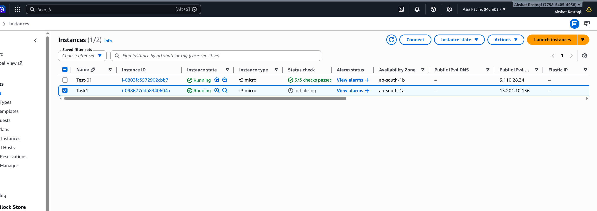
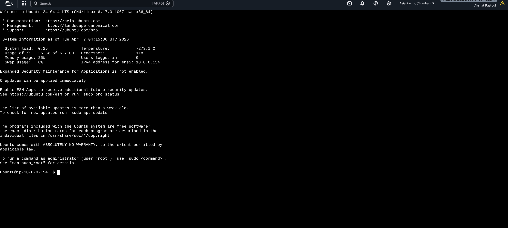
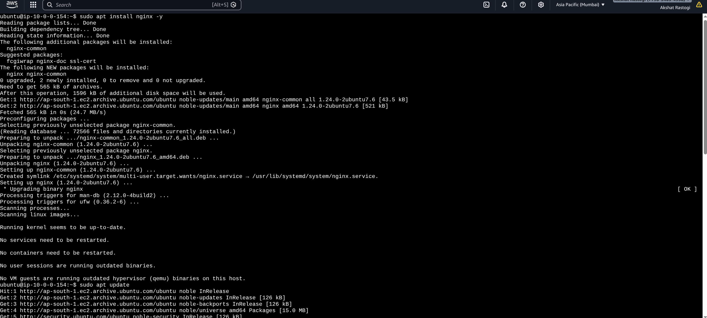
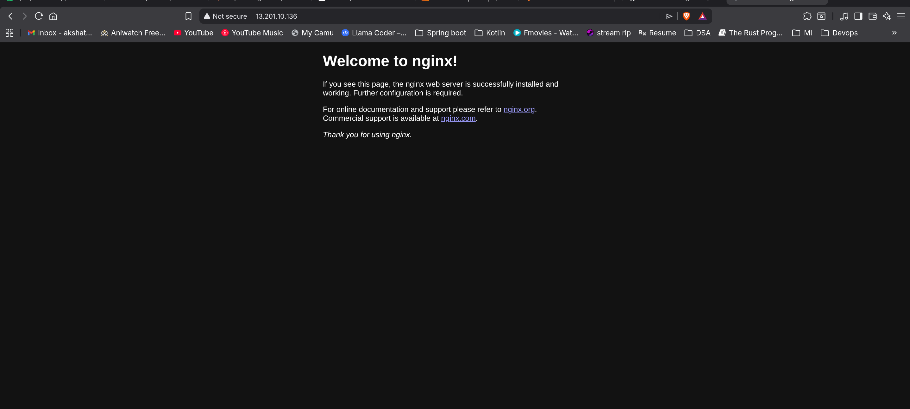

# Step 1

Launched EC2 instance with Ubuntu 24.04 LTS, t3.micro instance type in ap-south-1a availability zone with public IPv4 address.

# Step 2

Connected to the EC2 instance via SSH using the private key and ubuntu user.

# Step 3

Updated system packages and installed nginx using apt package manager.

# Step 4

Enabled nginx to start on boot and started the nginx service.

# Step 5

Verified nginx is running and checked its status.

# Step 6

Accessed the nginx welcome page via browser using the public IP address of the EC2 instance.

