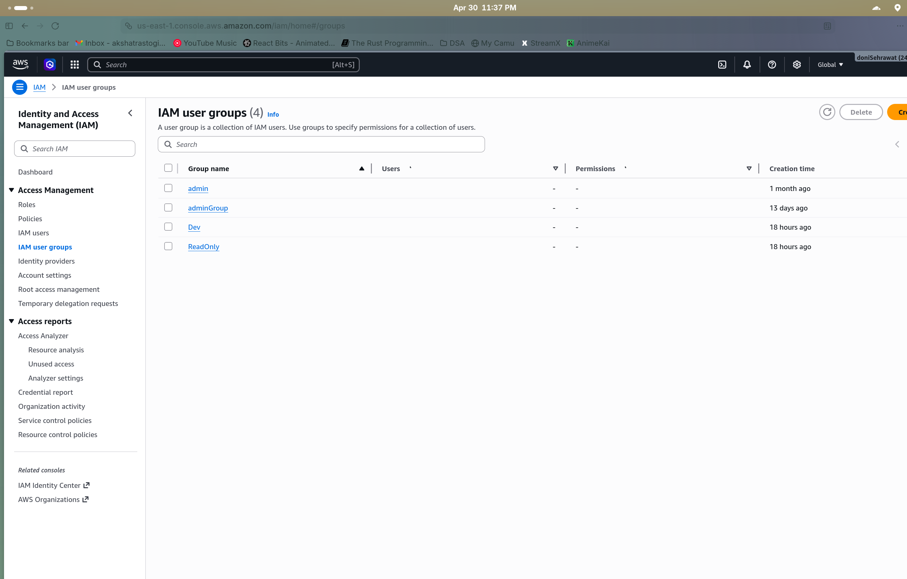
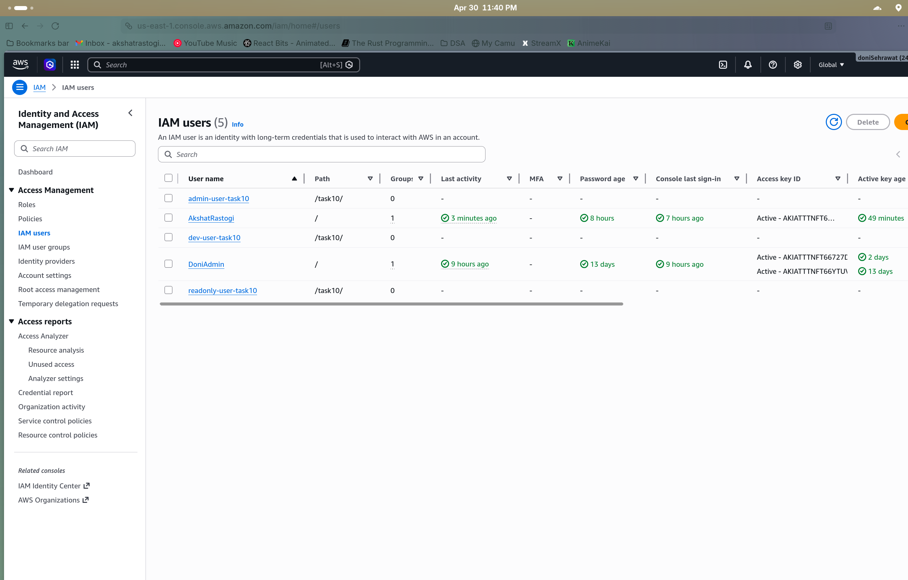
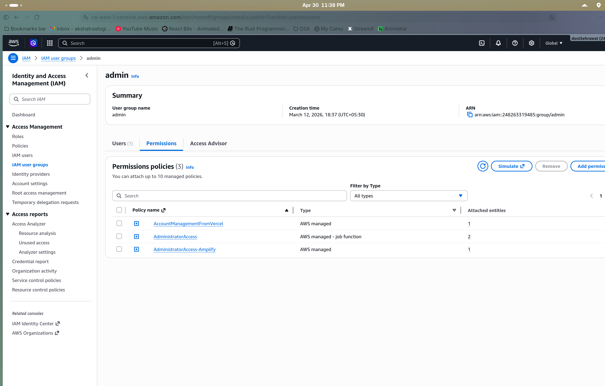
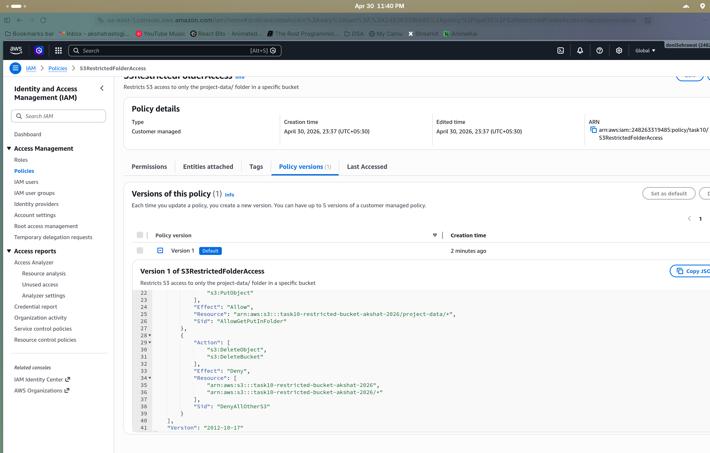

# Task 10: IAM Best Practices

# Step 1

Created IAM groups (Admin, Dev, ReadOnly) with least-privilege policies and configured account-level password policy.

# Step 2

Created IAM users and assigned them to the appropriate groups.

# Step 3

Configured Admin group permissions with full administrative access.

# Step 4

Verified S3 access permissions for the Dev group to confirm least-privilege is working.

