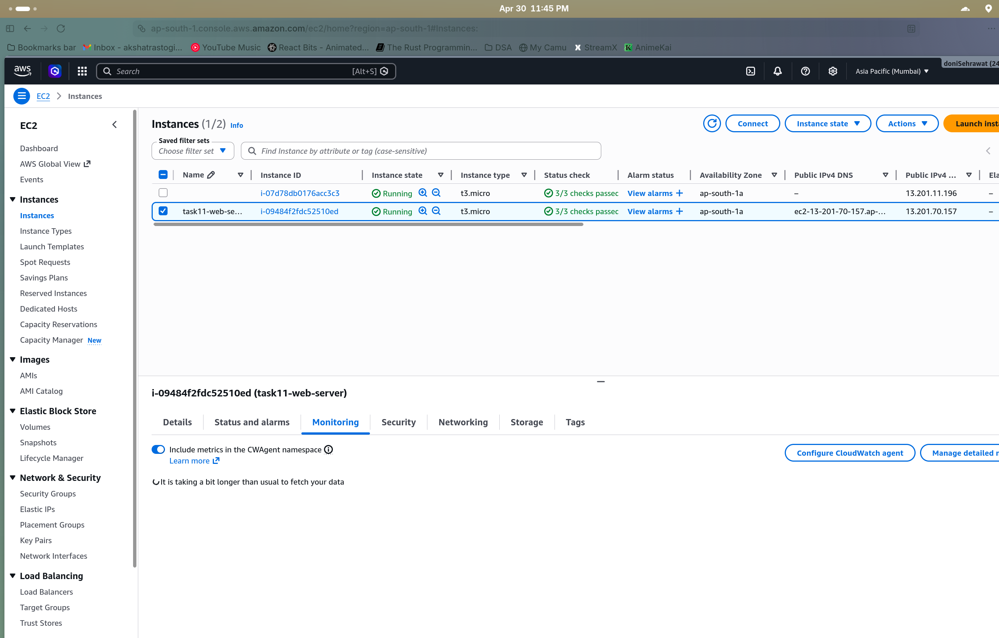
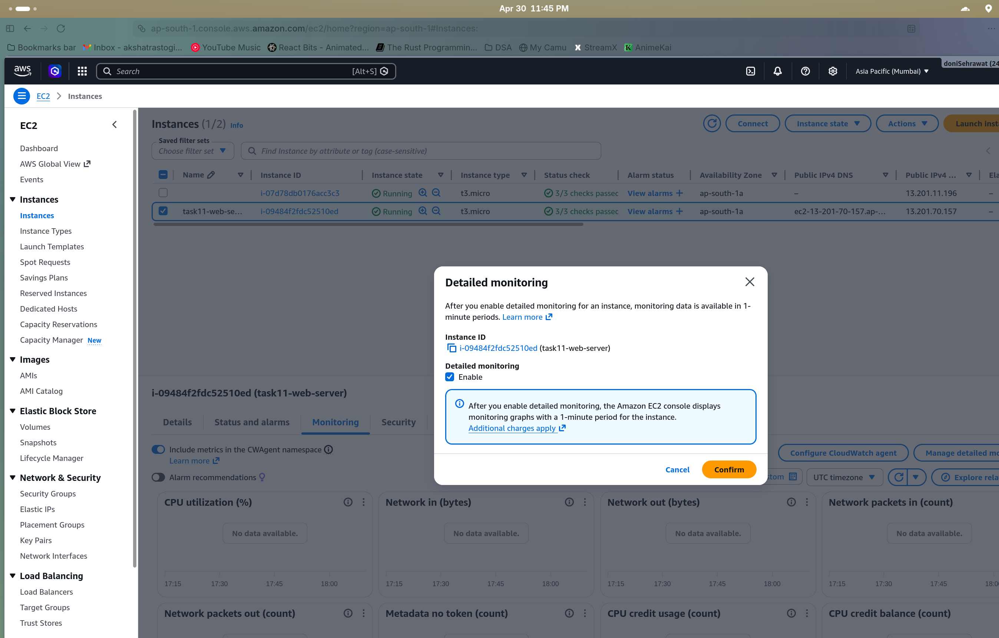
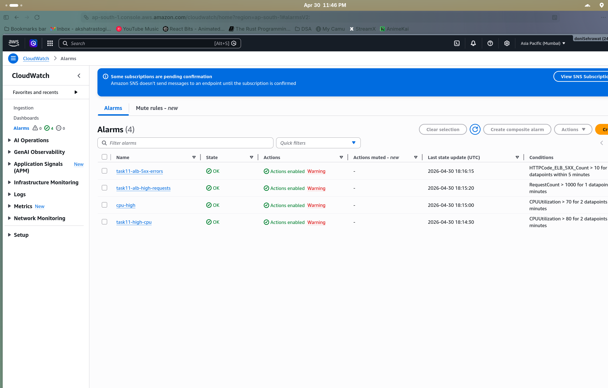
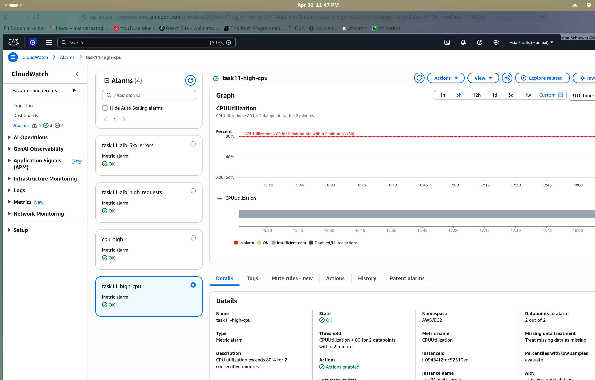
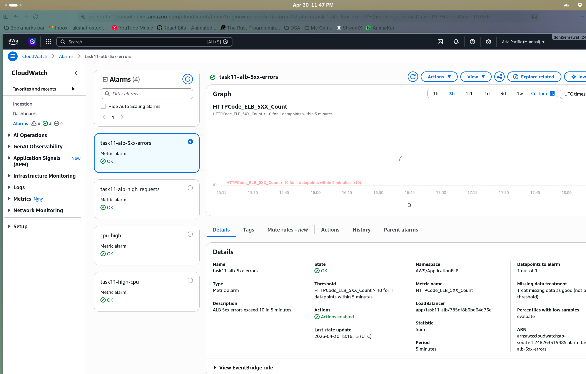
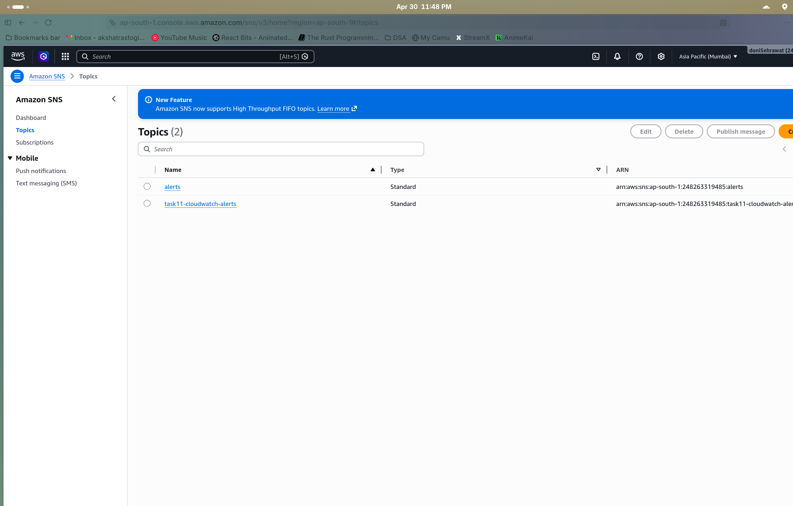
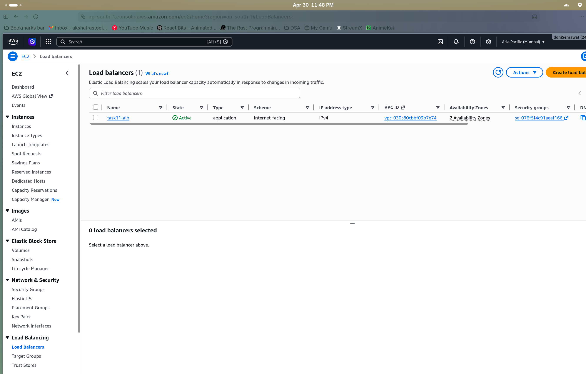

# Task 11: EC2 Monitoring with CloudWatch and SNS

# Step 1

Launched an EC2 instance with detailed monitoring enabled.

# Step 2

Enabled detailed monitoring on the EC2 instance for 1-minute interval metrics.

# Step 3

Created CloudWatch alarms for high CPU utilization and 5xx errors.

# Step 4

Configured the high CPU alarm to trigger when CPU exceeds 80%.

# Step 5

Set up 5xx error alarm on the Application Load Balancer.

# Step 6

Created an SNS topic for alert notifications.

# Step 7

Verified the ALB is running and associated with the monitoring setup.

