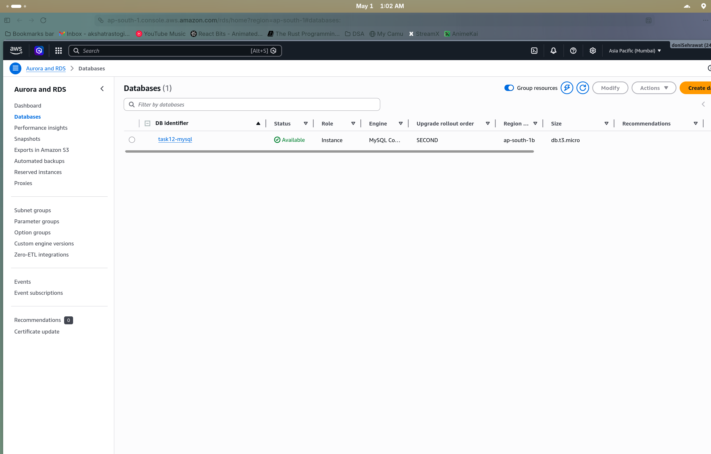
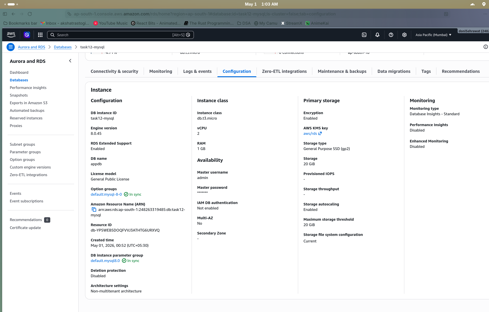
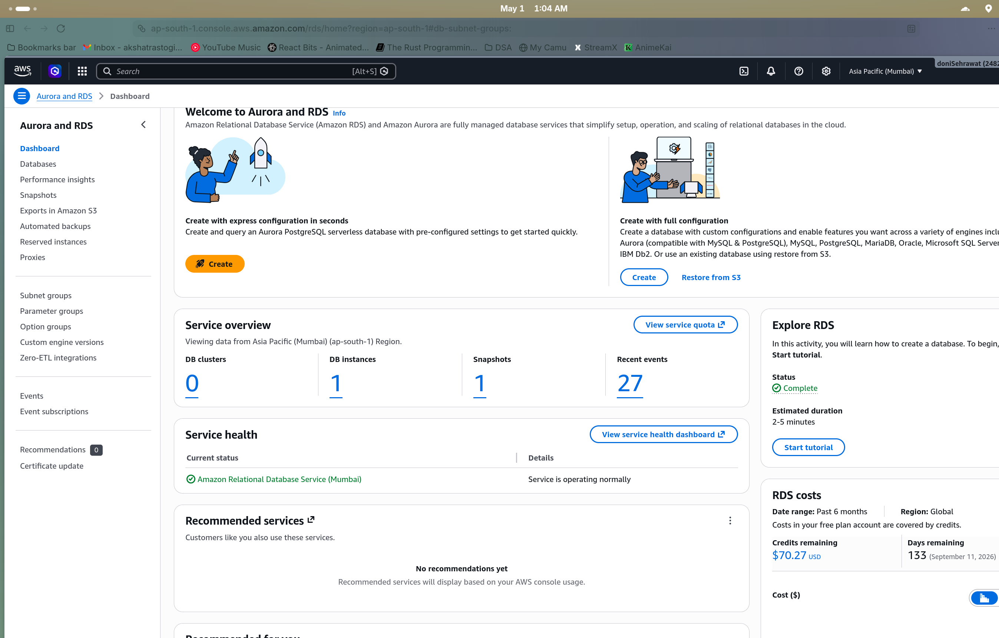
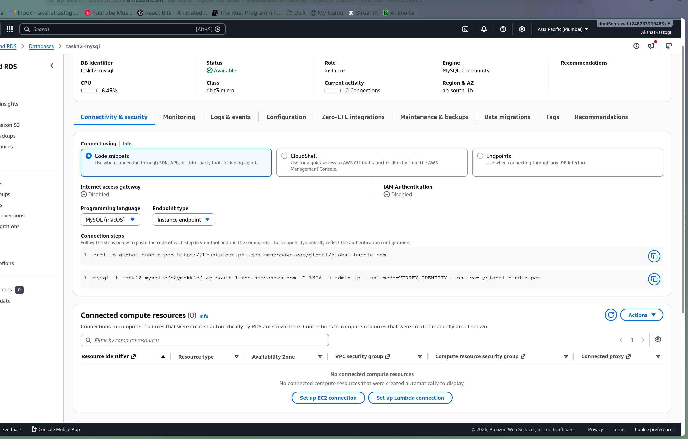
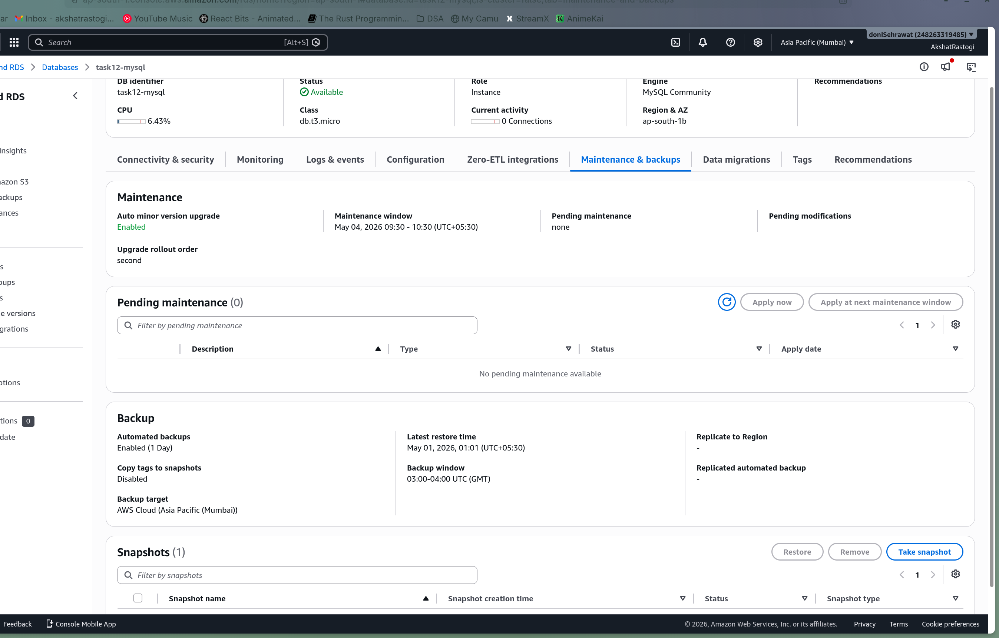
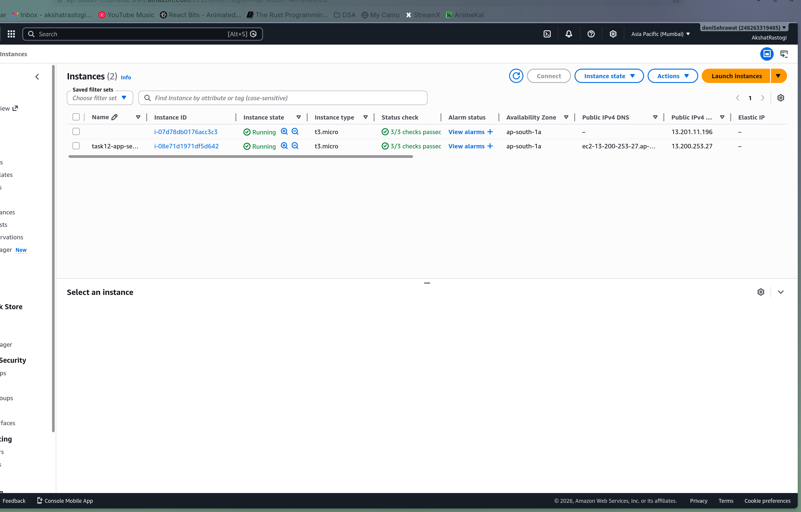

# Task 12: RDS MySQL Deployment

# Step 1

Launched an RDS MySQL instance in a private subnet with db.t3.micro instance class.

# Step 2

Configured the RDS instance settings including engine version, storage, and backup retention.

# Step 3

Created a DB Subnet Group spanning two availability zones for the RDS instance.

# Step 4

Verified connectivity and security settings on the RDS instance.

# Step 5

Checked the maintenance and backup configuration for automated backups.

# Step 6

Launched an EC2 instance to connect to the RDS database from within the VPC.

