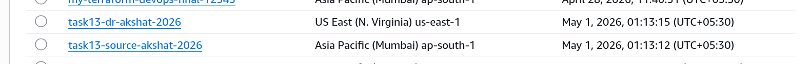
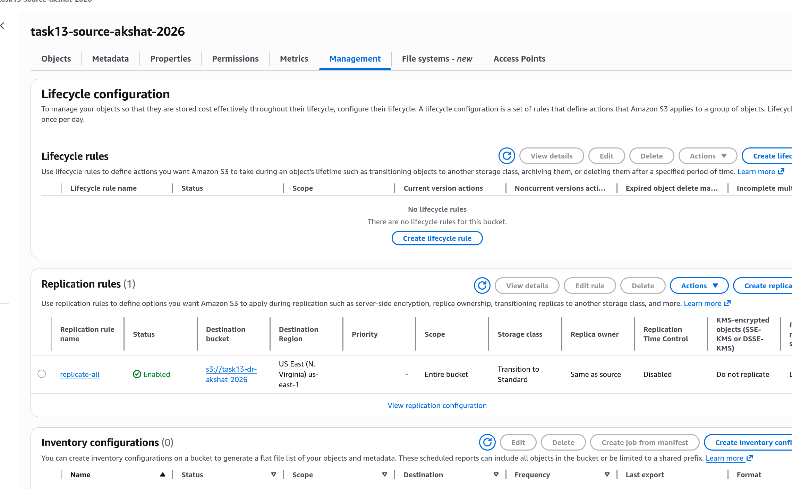
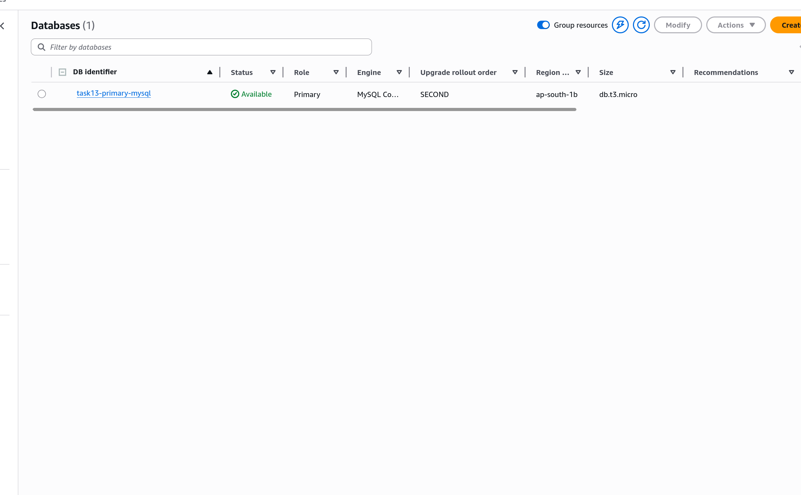
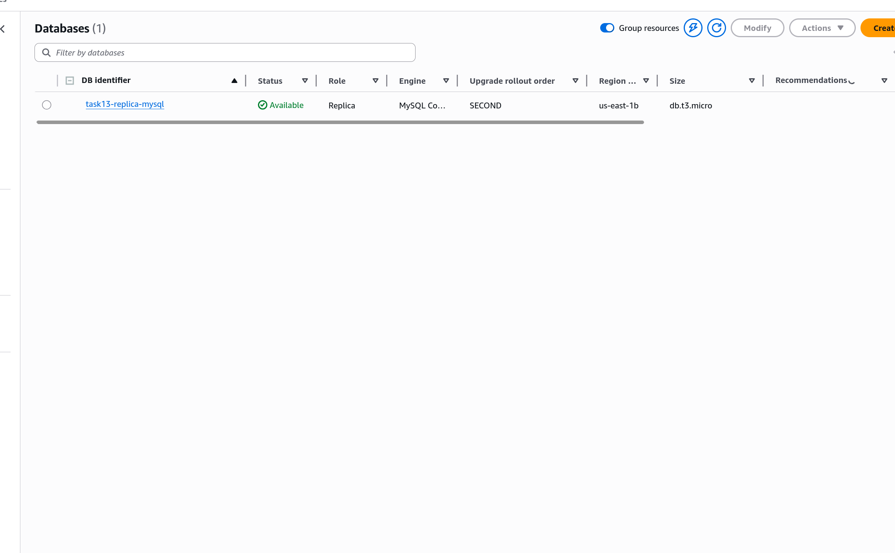
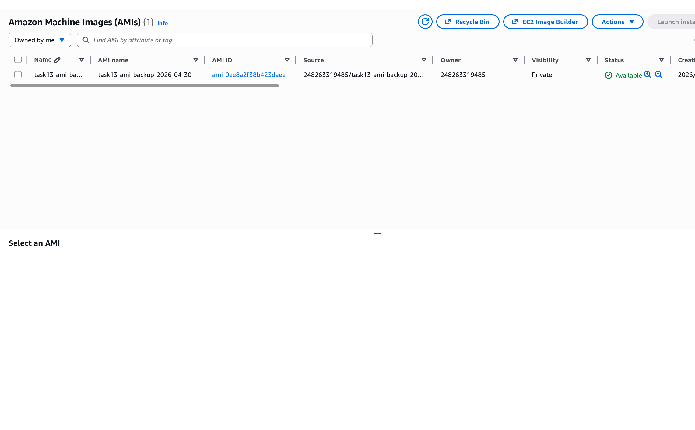

# Task 13: Disaster Recovery Setup

# Step 1

Created source and destination S3 buckets for cross-region replication.

# Step 2

Configured S3 replication rules to replicate objects from source to destination bucket.

# Step 3

Launched the RDS primary MySQL instance in the primary region.

# Step 4

Created a cross-region read replica of the RDS instance in the DR region.

# Step 5

Created an AMI backup of the EC2 app server for disaster recovery.

