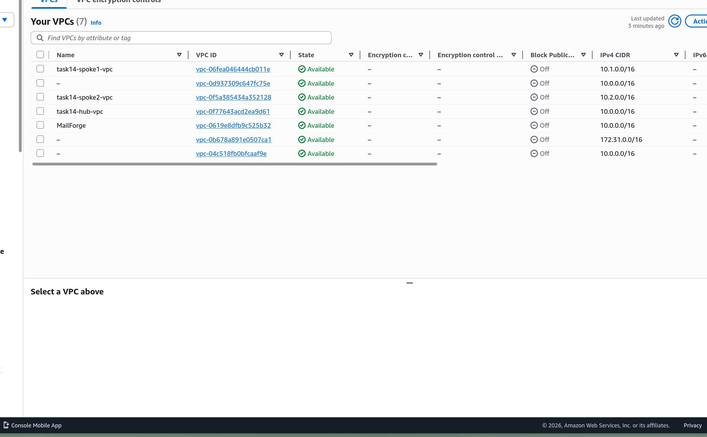
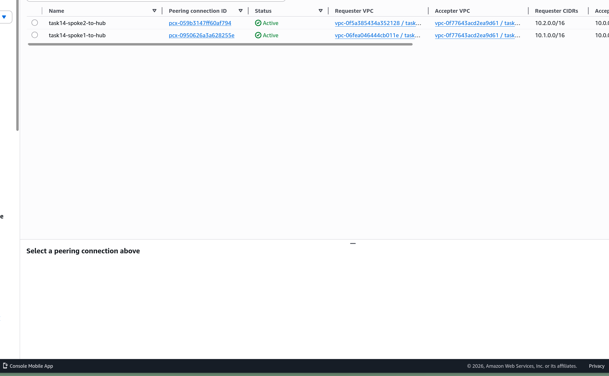
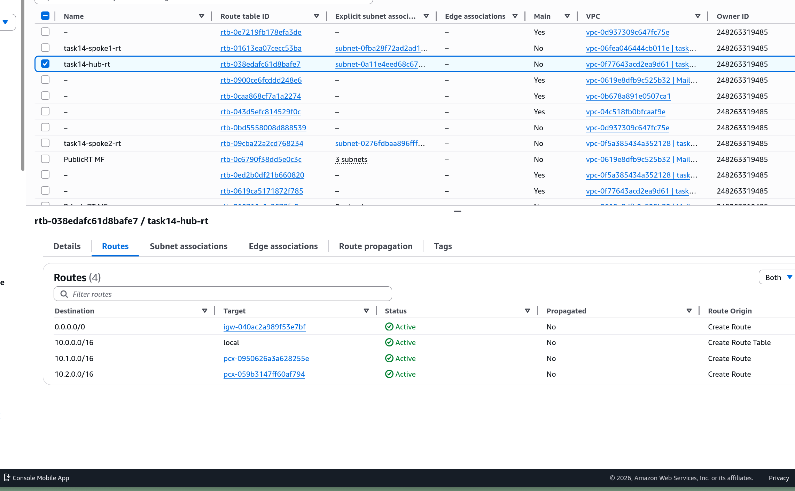
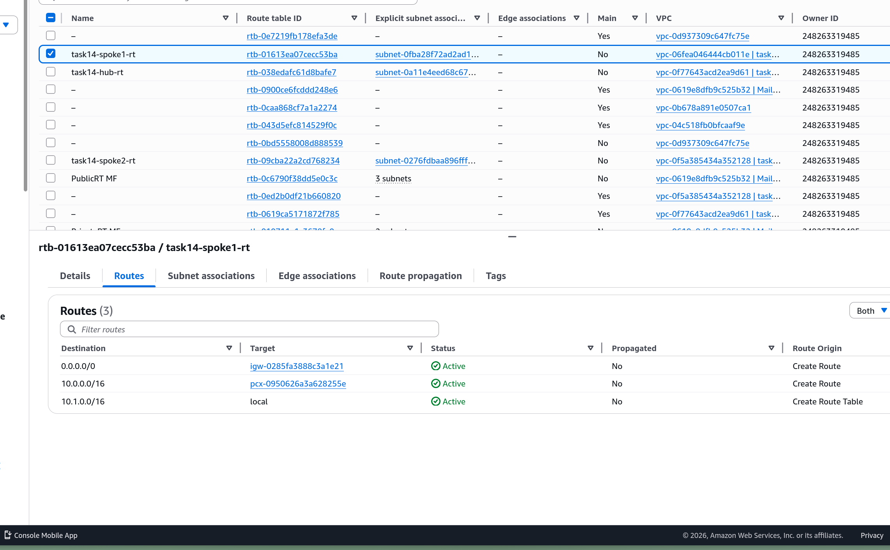
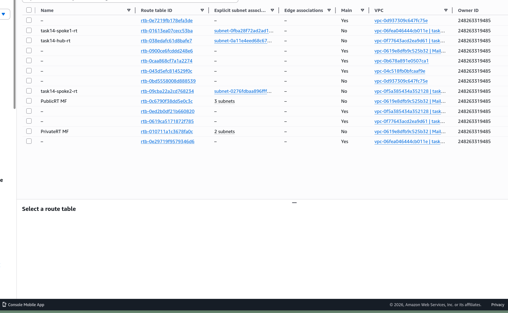

# Task 14: Hub-and-Spoke VPC Architecture

# Step 1

Created three VPCs — Hub, Spoke1, and Spoke2 — for the hub-and-spoke architecture.

# Step 2

Established VPC Peering connections between Hub-Spoke1 and Hub-Spoke2.

# Step 3

Configured the Hub route table with routes to both spoke VPCs via peering connections.

# Step 4

Configured the Spoke route tables with routes back to the Hub VPC.

# Step 5

Verified all route tables are correctly associated with the proper subnets.

# Step 6

Tested connectivity by pinging from Spoke1 to Hub — ping was successful.

# Step 7

Tested connectivity from Spoke1 to Spoke2 — ping failed as expected since spokes cannot communicate directly.

