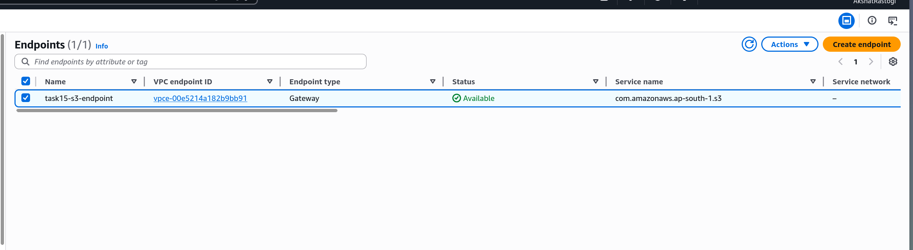
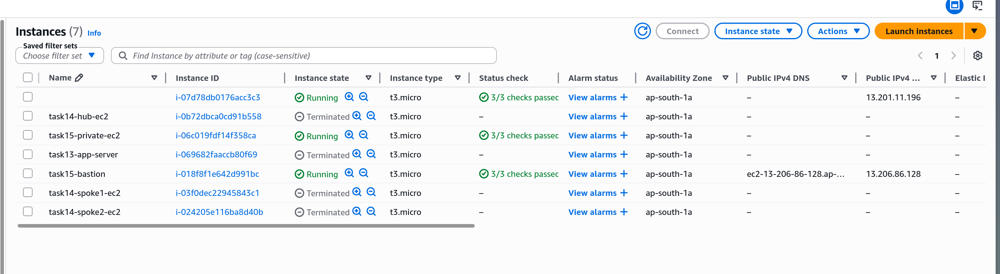
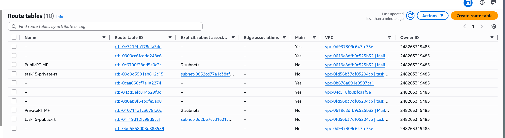

# Task 15: Private EC2 with S3 Access via VPC Endpoint

# Step 1

Created a VPC Gateway Endpoint for S3 so the private EC2 can access S3 without internet.

# Step 2

Launched EC2 instances — a bastion in public subnet and a private instance with no internet access.

# Step 3

Verified the private route table has the S3 endpoint route but no internet route.

