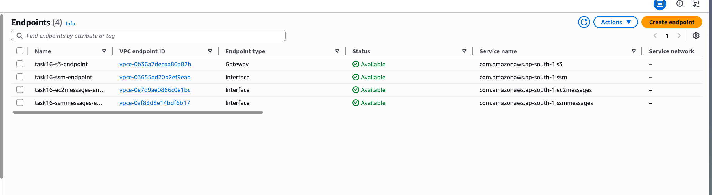
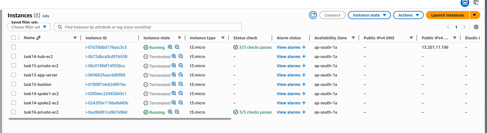
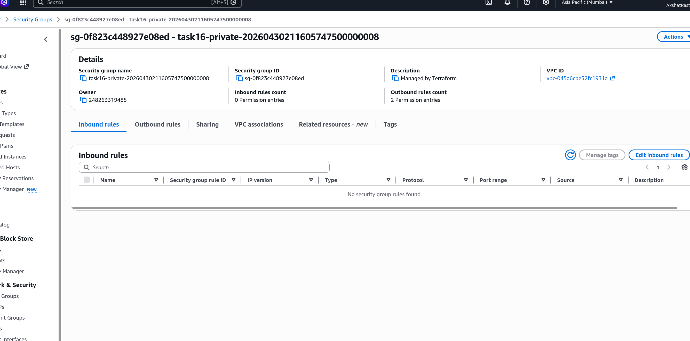
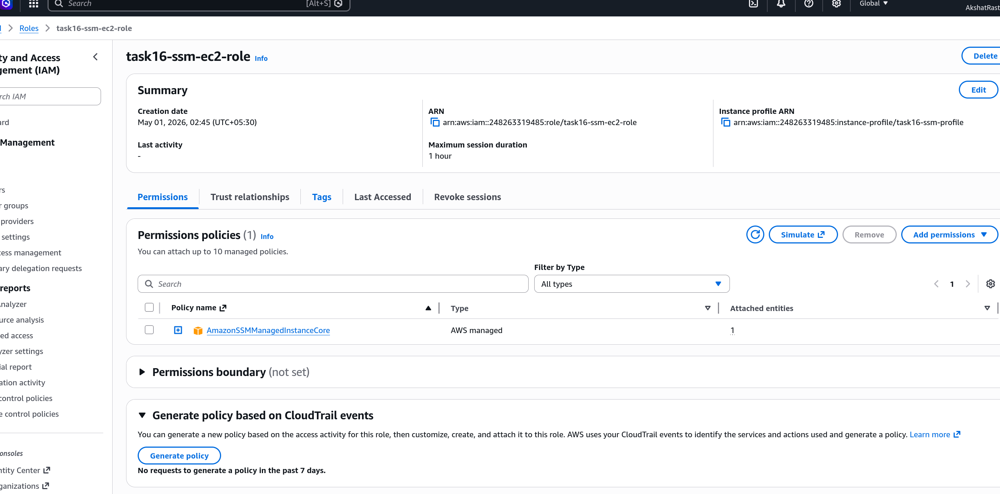

# Task 16: Bastion-less Architecture with SSM

# Step 1

Created VPC Interface Endpoints for SSM so EC2 instances can be managed without a bastion host.

# Step 2

Launched EC2 instances with the SSM agent and attached the SSM IAM policy.

# Step 3

Configured security groups to allow HTTPS traffic required for SSM communication.

# Step 4

Attached the AmazonSSMManagedInstanceCore policy to the EC2 IAM role.

