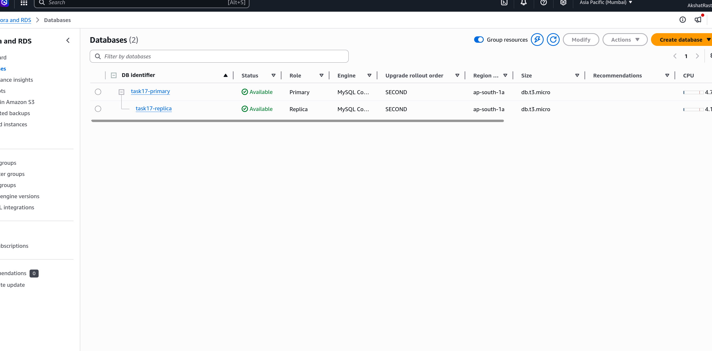
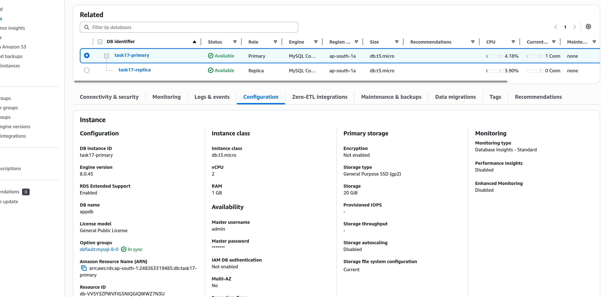
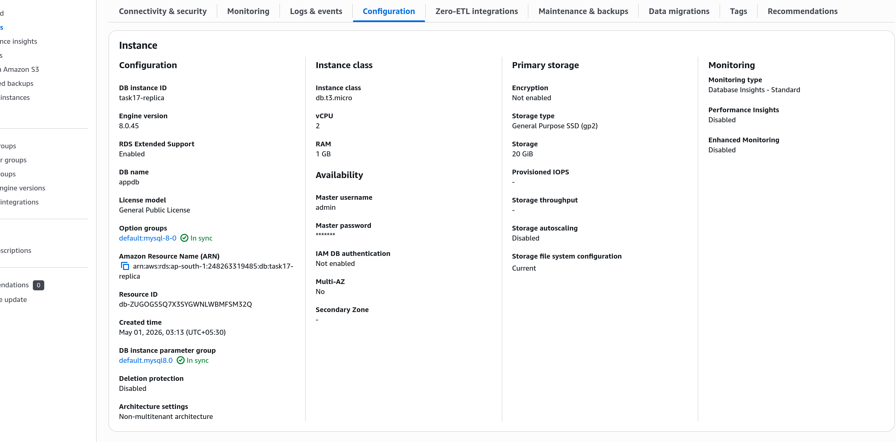
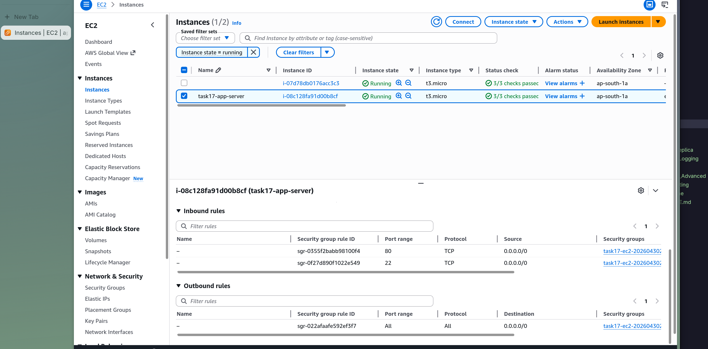

# Task 17: RDS Read Replica

# Step 1

Created an RDS MySQL primary instance and a read replica for read/write traffic separation.

# Step 2

Configured the primary RDS instance with automated backups and encryption.

# Step 3

Created the read replica that replicates data from the primary instance.

# Step 4

Launched an EC2 app server that routes write traffic to primary and read traffic to the replica.

