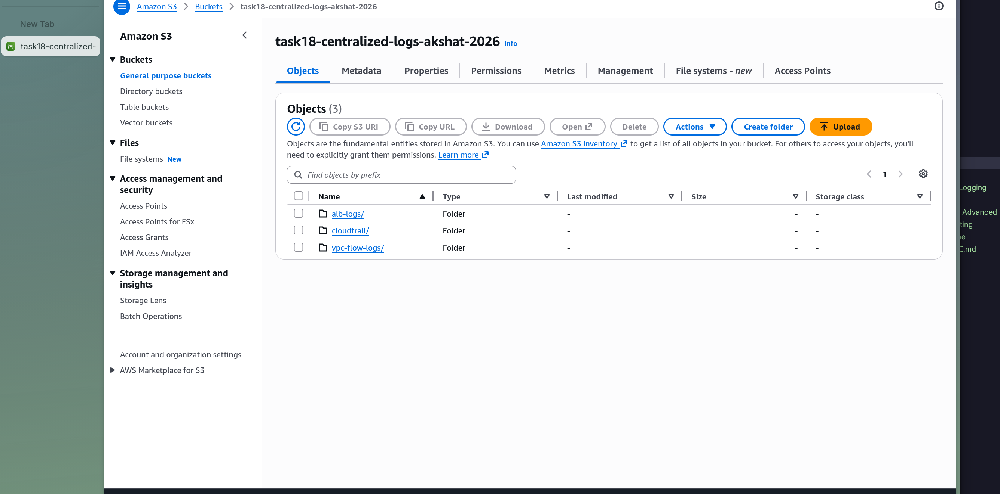
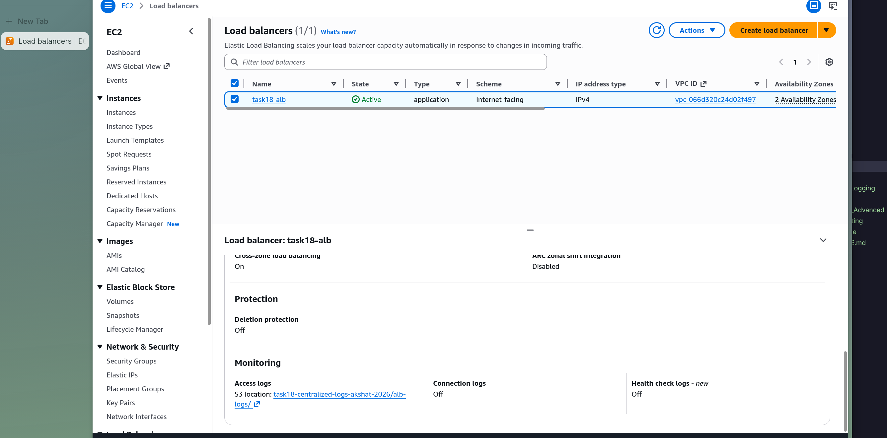
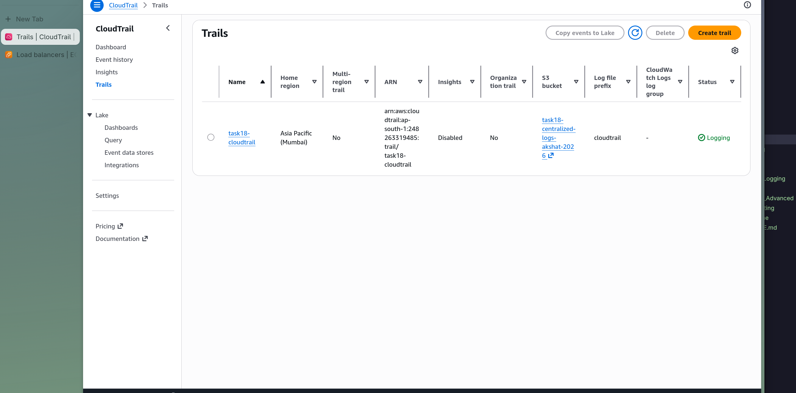
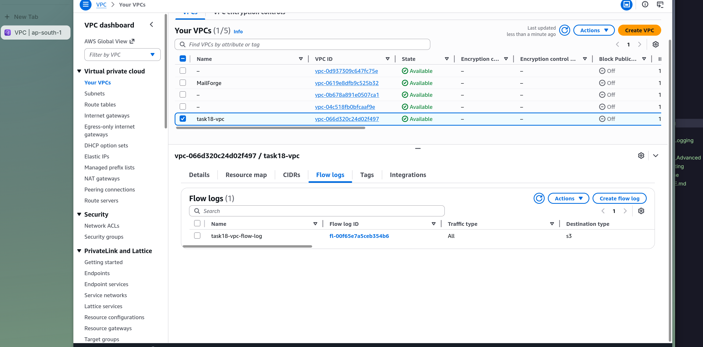
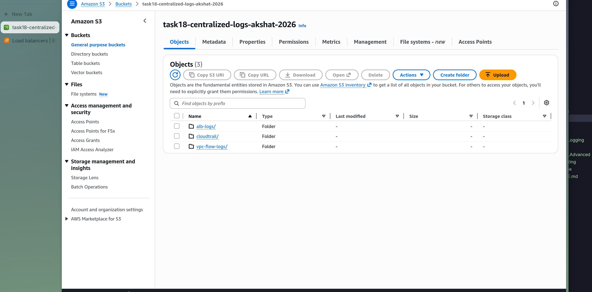
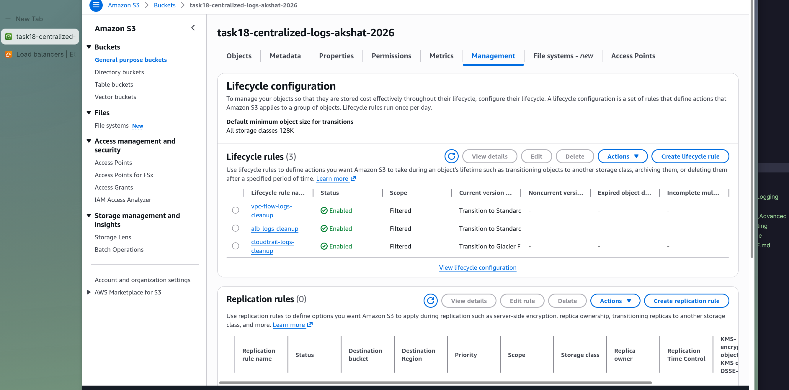

# Task 18: Centralized Logging

# Step 1

Set up centralized logging with VPC Flow Logs, CloudTrail, and ALB access logs stored in a single S3 bucket.

# Step 2

Created an Application Load Balancer with access logging enabled.

# Step 3

Enabled CloudTrail for API activity logging across the account.

# Step 4

Configured VPC Flow Logs to capture network traffic information.

# Step 5

Verified all logs are being stored in the centralized S3 bucket.

# Step 6

Configured lifecycle rules on the logs bucket for automatic archival and deletion.

