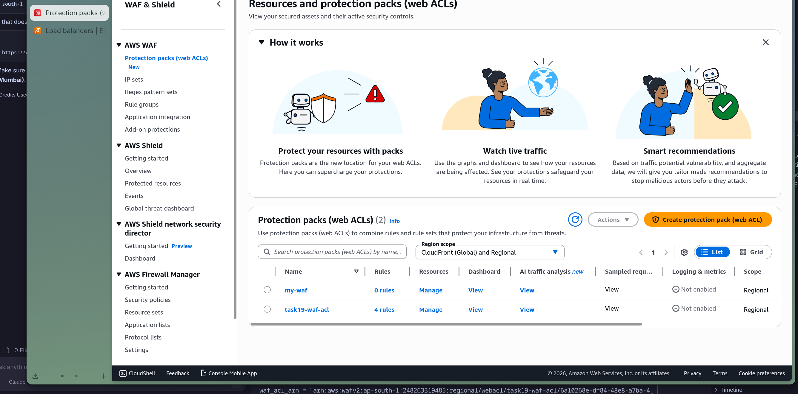
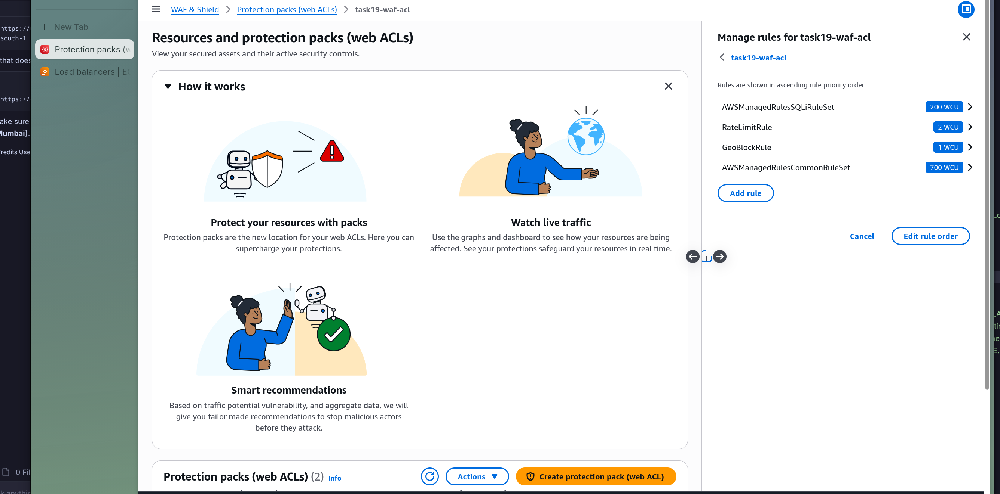
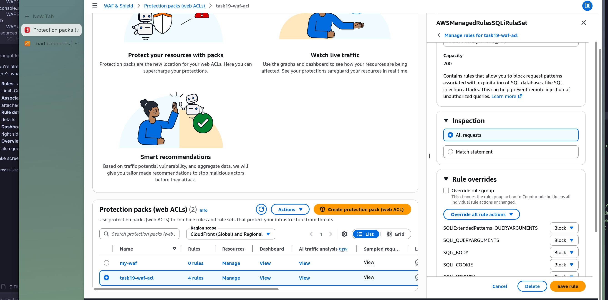
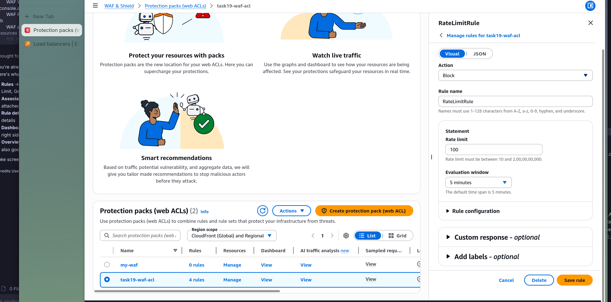
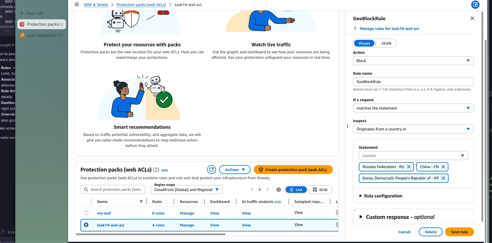
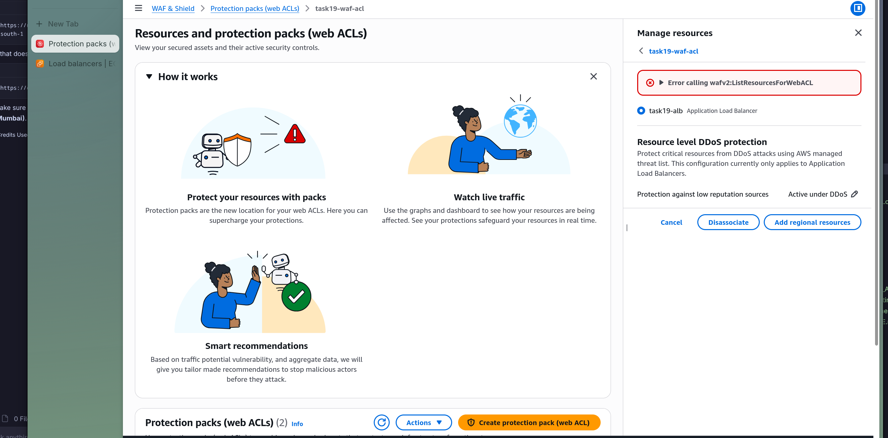
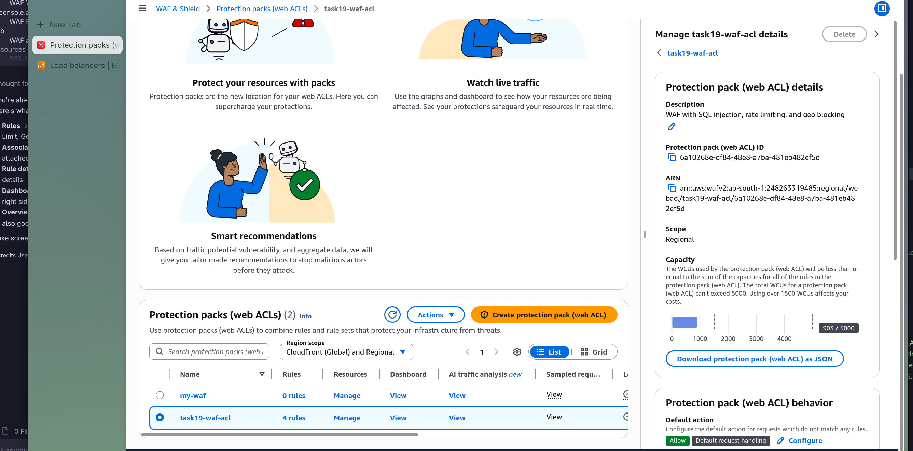

# Task 19: WAF (Web Application Firewall)

# Step 1

Created a WAF Web ACL with SQL injection protection, rate limiting, and geo-blocking rules.

# Step 2

Configured all WAF rules including SQL injection, rate limiting, and geo-blocking.

# Step 3

Viewed the SQL injection rule details using AWS Managed Rules.

# Step 4

Configured the rate limiting rule to block IPs exceeding 100 requests per 5 minutes.

# Step 5

Set up geo-blocking to restrict traffic from specific countries.

# Step 6

Associated the WAF Web ACL with the Application Load Balancer.

# Step 7

Verified the WAF overview dashboard showing all rules and metrics.

