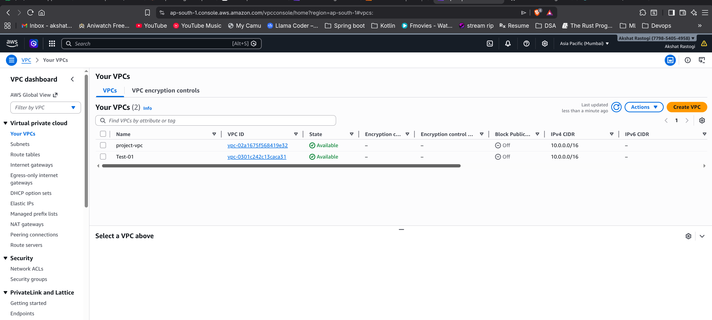
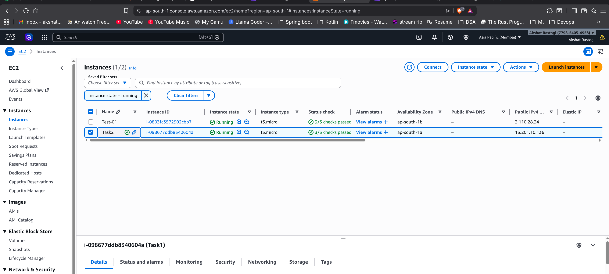
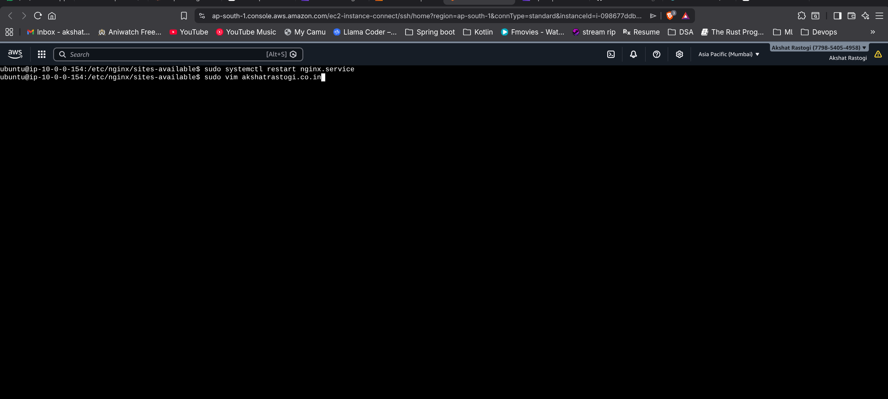
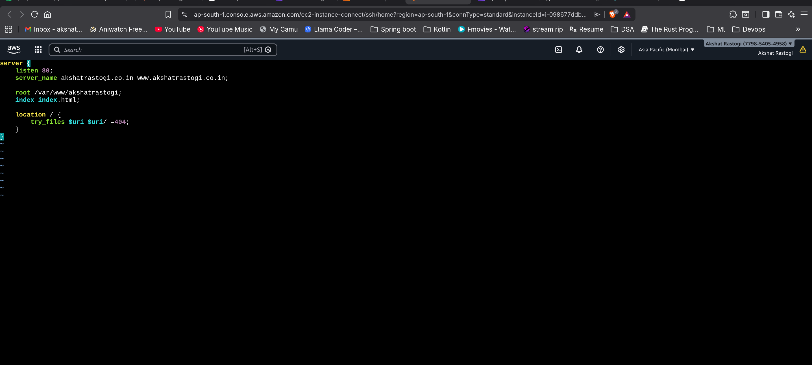
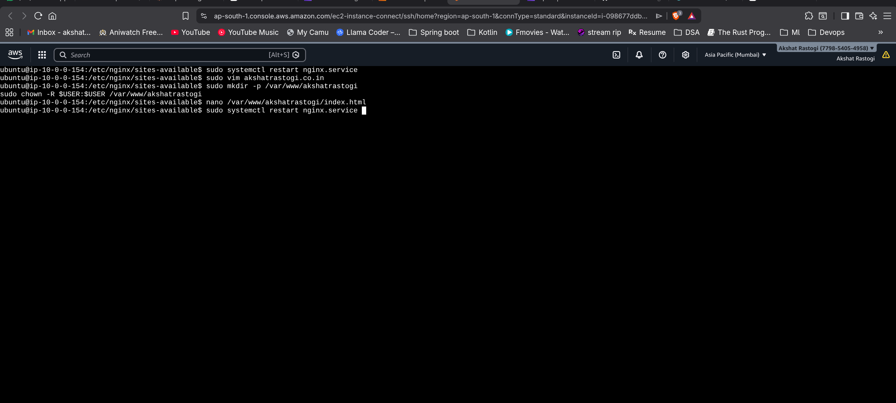
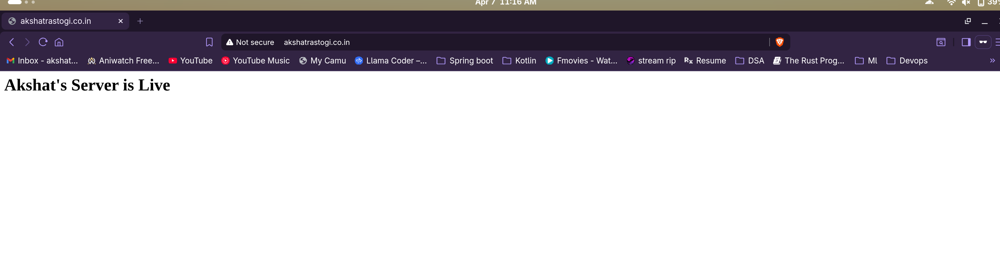

# Step 1

Created a new VPC in AWS with custom networking configuration. Selected the VPC from the dashboard and configured it with appropriate CIDR block and settings.

# Step 2

Launched an EC2 instance within the VPC. Selected t3.micro instance type with Ubuntu 24.04 LTS and assigned a public IPv4 address in the ap-south-1a availability zone.

# Step 3

Connected to the EC2 instance via SSH using the EC2 Instance Connect feature. Accessed the terminal to run system commands.

# Step 4

Edited the nginx server configuration file using nano editor to customize the server settings, including server name and root directory configuration.

# Step 5

Created a custom index.html file in the nginx root directory (/var/www/akshatrastogi) with personalized content. Set proper permissions and restarted the nginx service.

# Step 6

Verified the website by accessing it through the browser at akshatrastogi.co.in. The custom webpage "Akshat's Server is Live" is now being served by nginx.

