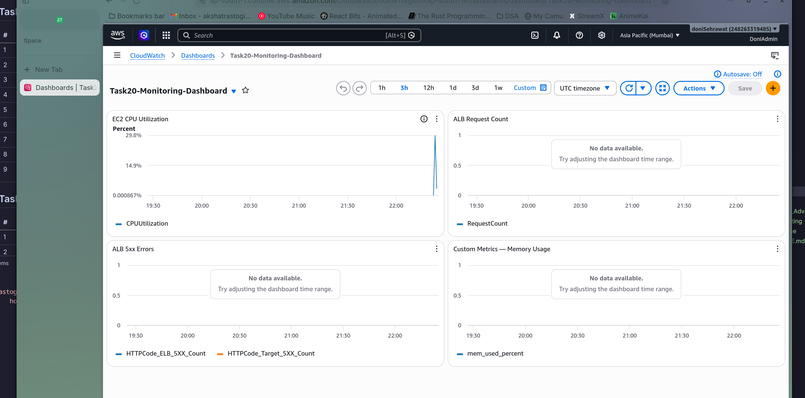
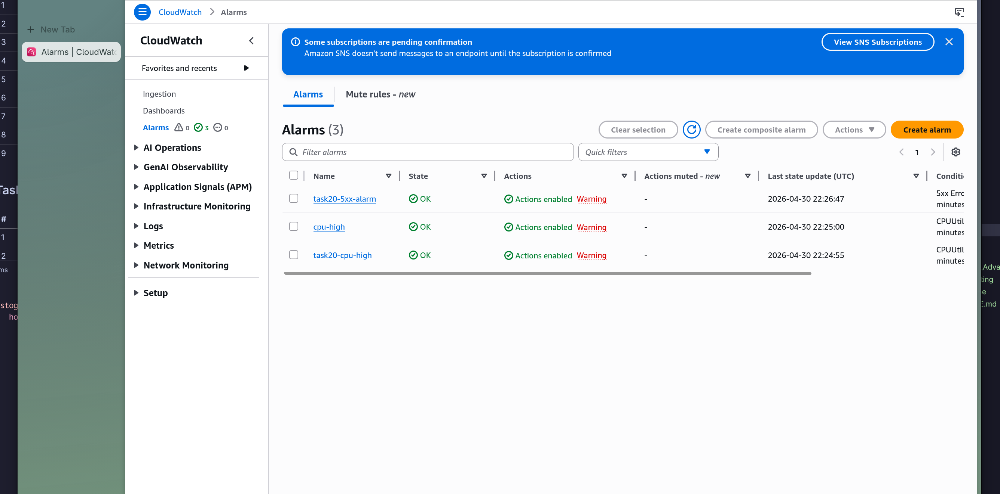
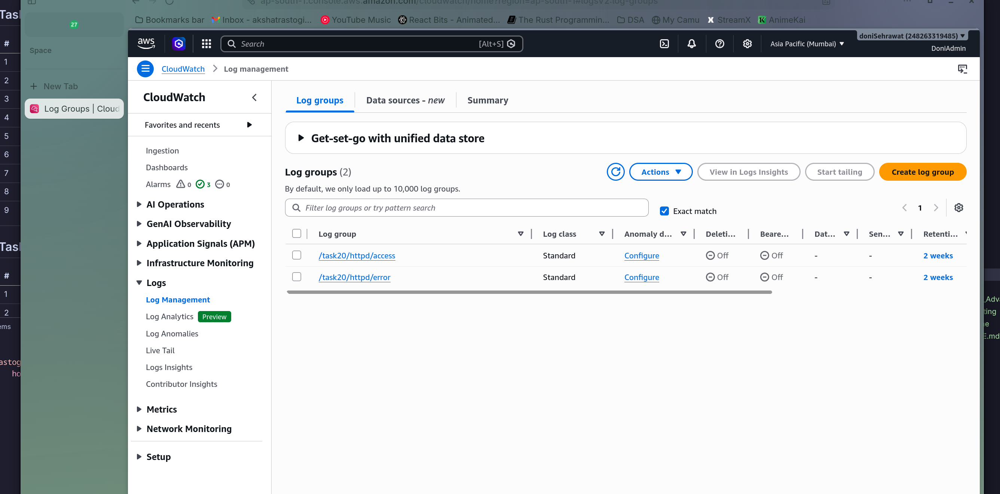
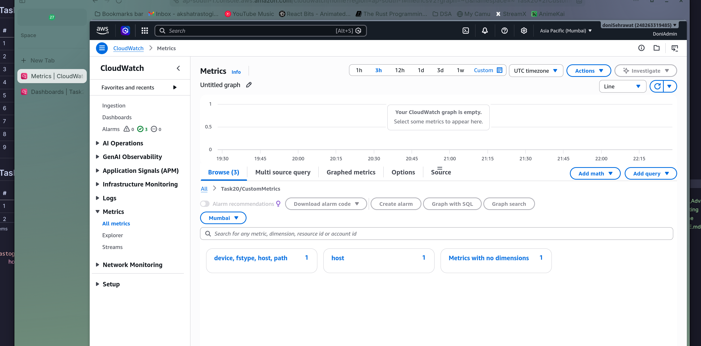
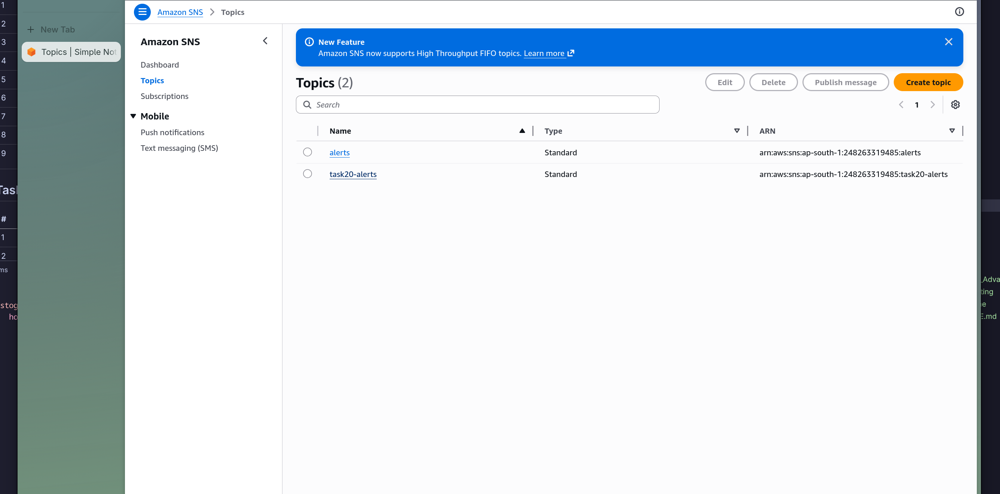

# Task 20: CloudWatch Advanced Monitoring

# Step 1

Created a CloudWatch dashboard with widgets for CPU utilization, request count, 5xx errors, and memory usage.

# Step 2

Set up CloudWatch alarms for CPU high and 5xx error rate monitoring.

# Step 3

Created CloudWatch Log Groups for capturing application logs.

# Step 4

Configured log-based metric filters to extract custom metrics from log data.

# Step 5

Viewed the custom metrics published by the CloudWatch agent.

# Step 6

Created an SNS topic with email subscription for alert notifications.

