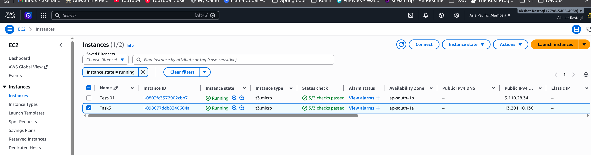
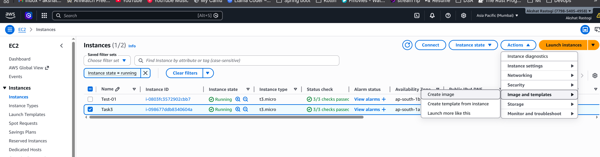
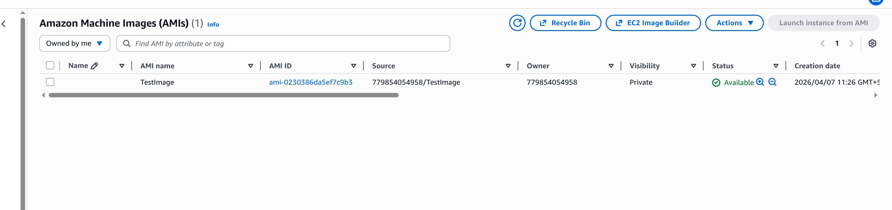
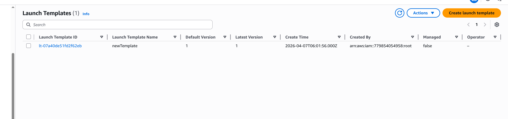
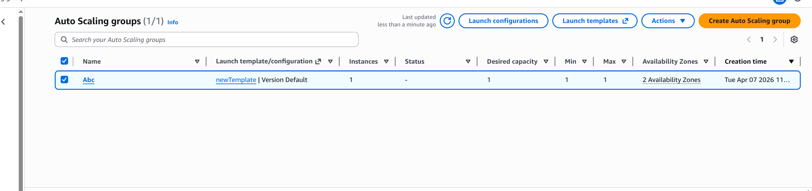

# Step 1

Created an EC2 instance with Ubuntu 24.04 LTS and t3.micro instance type. Configured the instance in the appropriate VPC and availability zone with public IP assignment enabled.

# Step 2

Installed a web application on the EC2 instance. Connected via SSH and set up the necessary dependencies and application files for the web server.

# Step 3

Added custom application files and configuration to the web server. Configured the web application files and permissions to ensure proper deployment.

# Step 4

Created a Launch Template from the configured EC2 instance. This template captures the instance configuration, including AMI, instance type, security groups, and custom user data scripts.

# Step 5

Configured an Auto Scaling Group using the Launch Template. Set up scaling policies with minimum, maximum, and desired capacity to automatically manage multiple instances based on demand.

