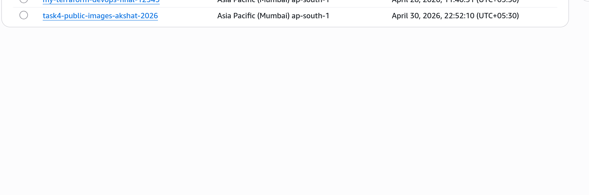
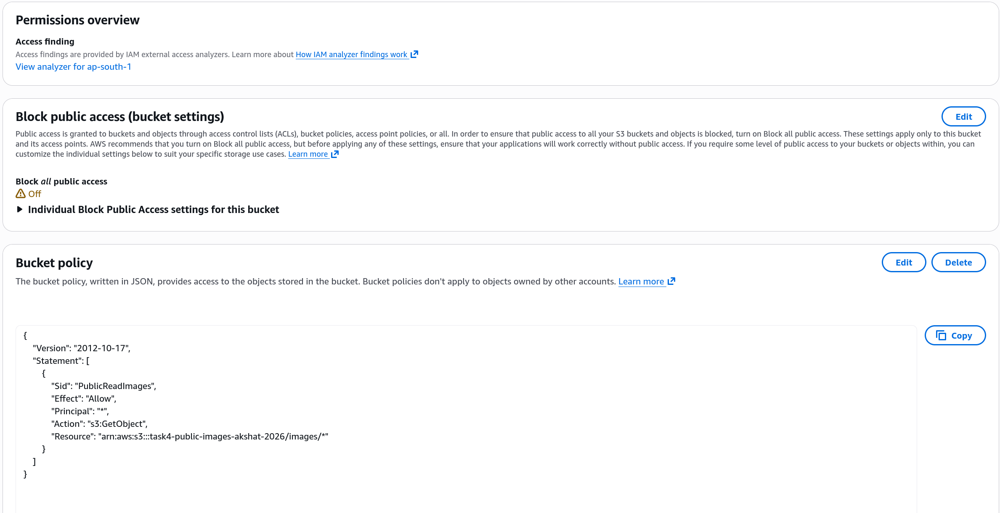
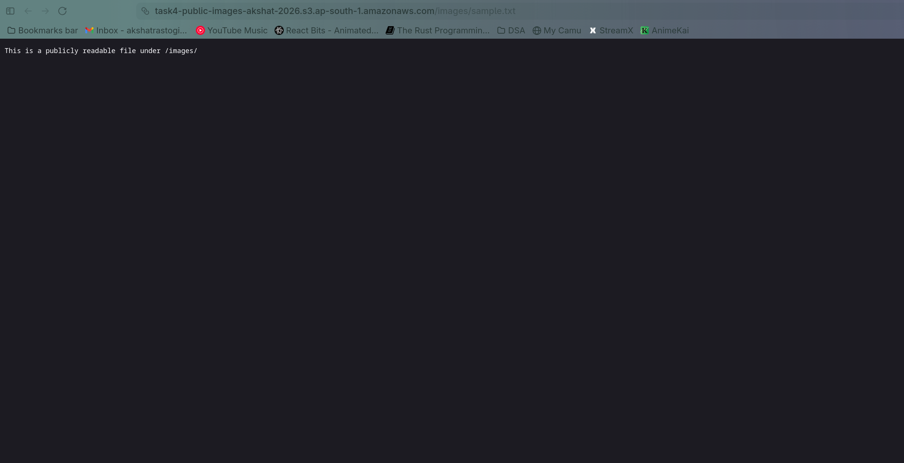
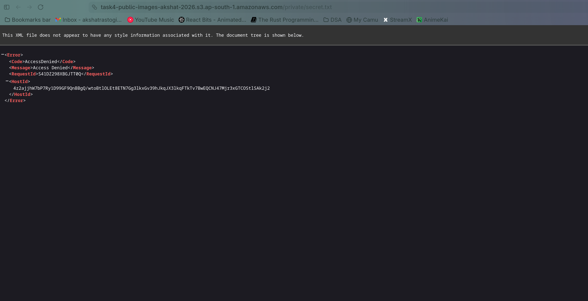

# Task 4: S3 Bucket with Public and Private Access

# Step 1

Created an S3 bucket where only /images/* is publicly readable and all other objects remain private.

# Step 2

Configured bucket policy to allow public read access only for the /images/* prefix.

# Step 3

Verified that objects under /images/* are publicly accessible.

# Step 4

Confirmed that objects outside /images/* remain private and return Access Denied.

