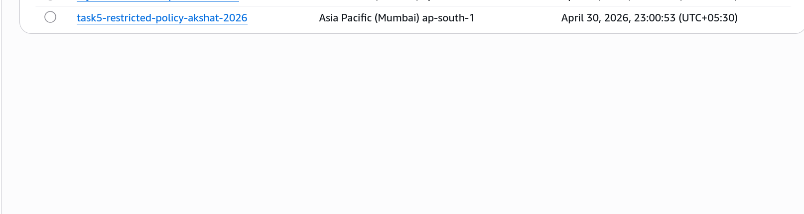
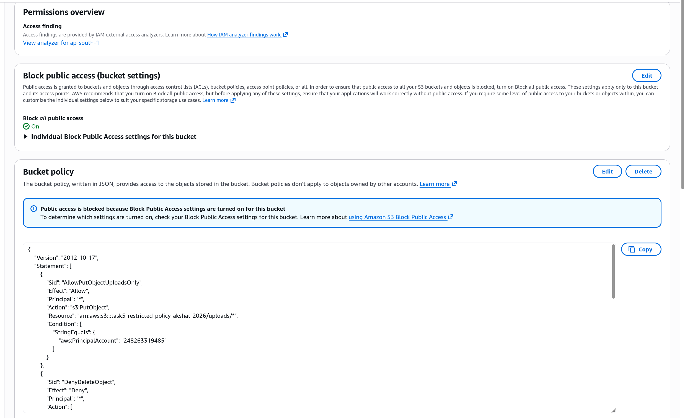

# Task 5: S3 Bucket Policy (PutObject, Deny Delete, Encryption)

# Step 1

Created an S3 bucket with a policy that allows PutObject only to uploads/*, denies DeleteObject, and denies uploads without server-side encryption.

# Step 2

Configured bucket permissions with the required policy rules for upload restrictions and encryption enforcement.

