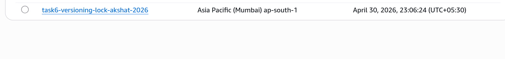
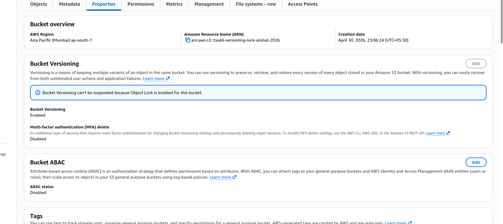
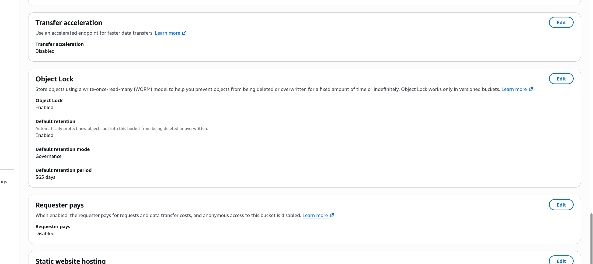
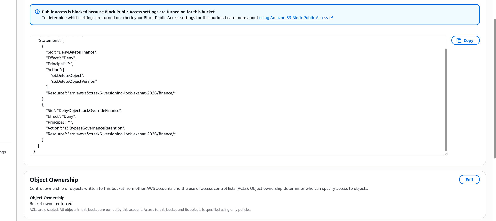
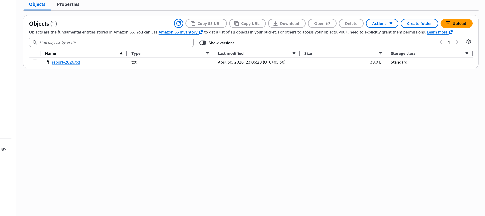

# Task 6: S3 Versioning and Object Lock

# Step 1

Created an S3 bucket with versioning enabled and Object Lock configured in Governance mode.

# Step 2

Enabled bucket properties including versioning and Object Lock settings.

# Step 3

Configured Object Lock retention in Governance mode to prevent deletion of objects under finance/*.

# Step 4

Verified the bucket policy that protects finance/* objects from deletion.

# Step 5

Confirmed the Object Lock configuration is active and working as expected.

