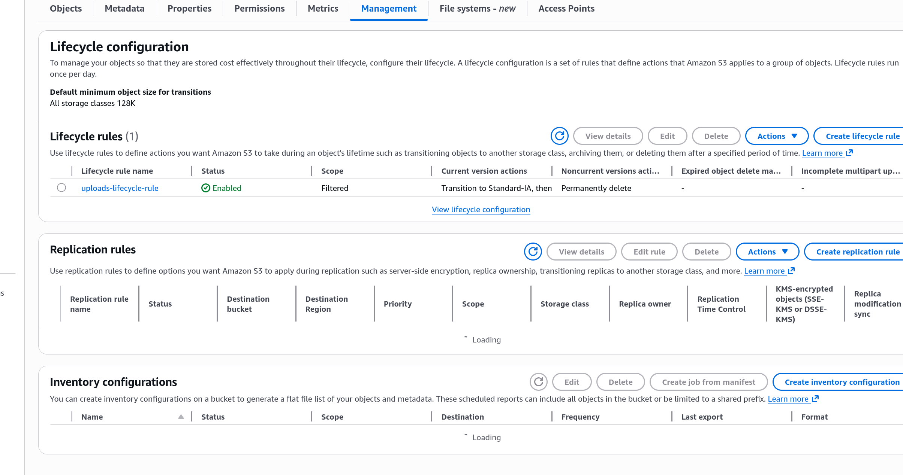
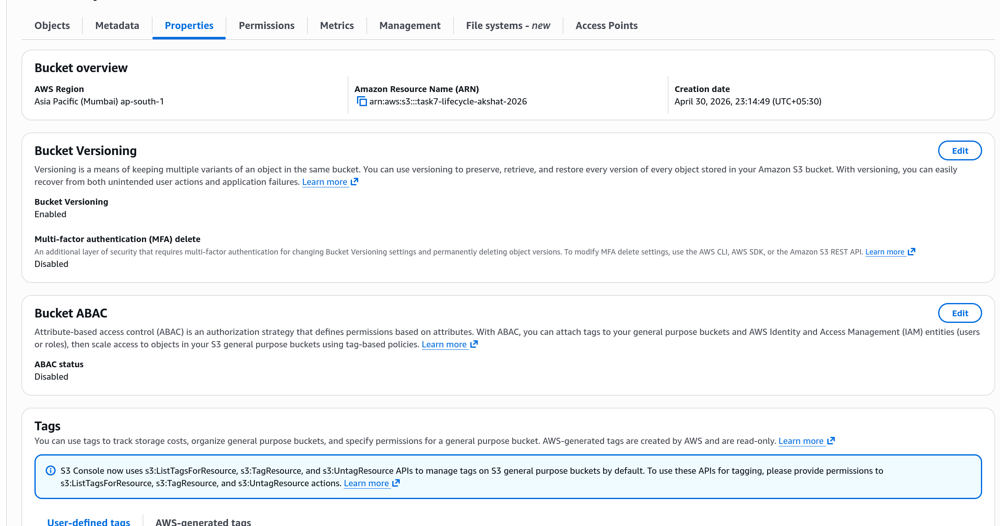
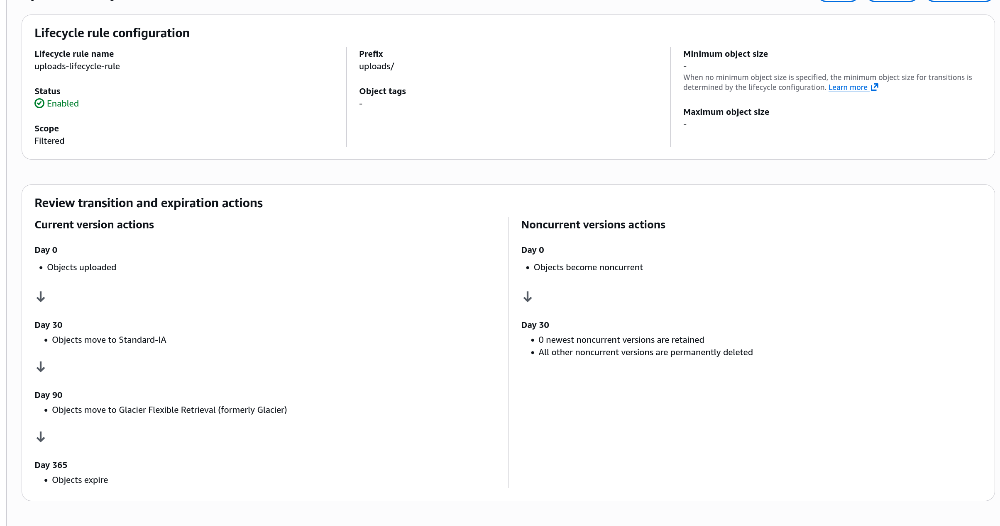

# Task 7: S3 Lifecycle Rules

# Step 1

Created an S3 bucket with lifecycle rules applied to uploads/* prefix.

# Step 2

Configured lifecycle rule: 30 days to Standard-IA, 90 days to Glacier, 365 days to Delete.

# Step 3

Enabled versioning on the bucket to support lifecycle transitions.

# Step 4

Verified the bucket policy is correctly configured alongside the lifecycle rules.

