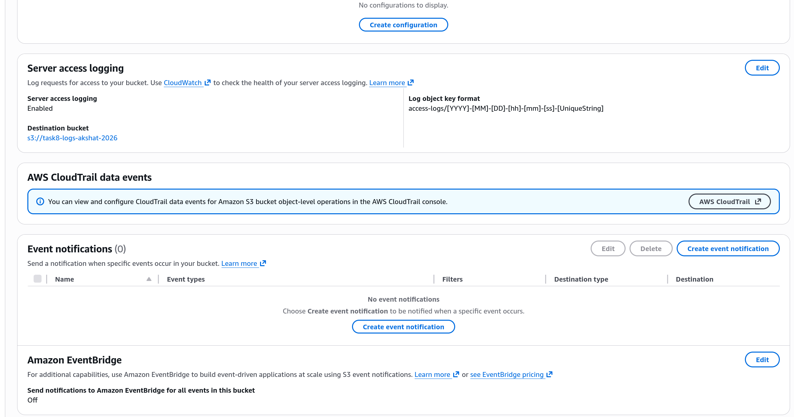
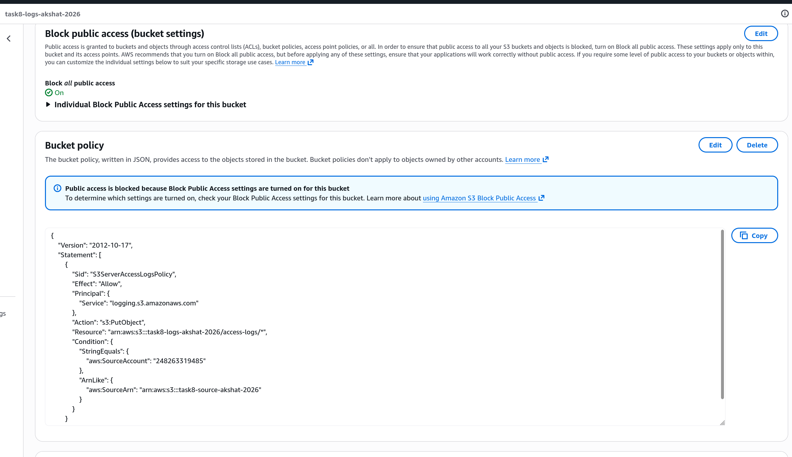
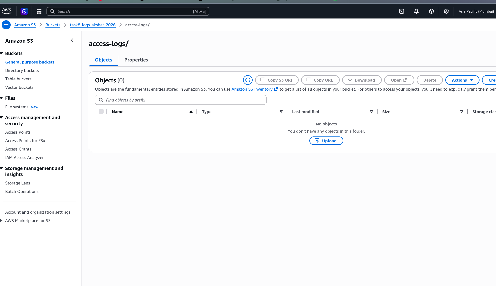
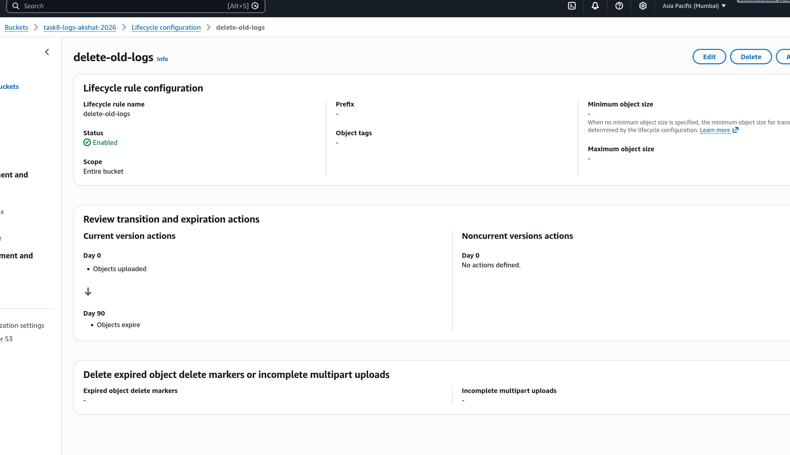

# Task 8: S3 Server Access Logging

# Step 1

Configured server access logging on the source bucket to deliver logs to a separate secure bucket.

# Step 2

Verified the logs bucket has public access blocked to ensure security.

# Step 3

Checked the access logs being delivered to the logs bucket.

# Step 4

Confirmed delete operation logs are being captured correctly.

