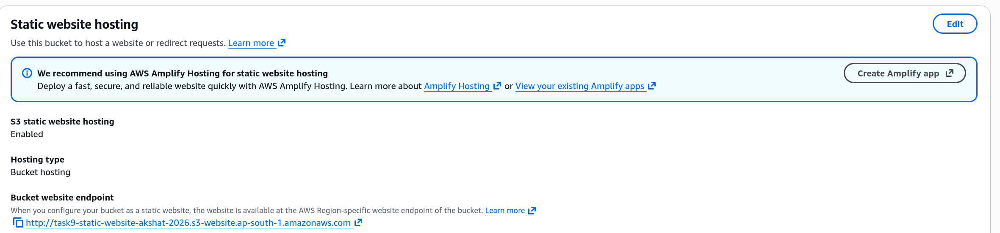
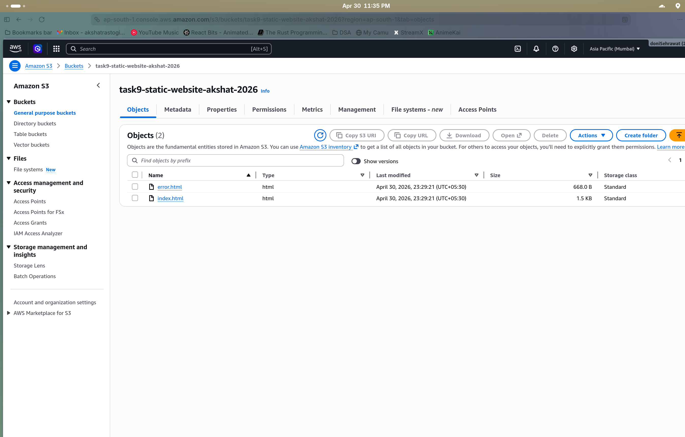
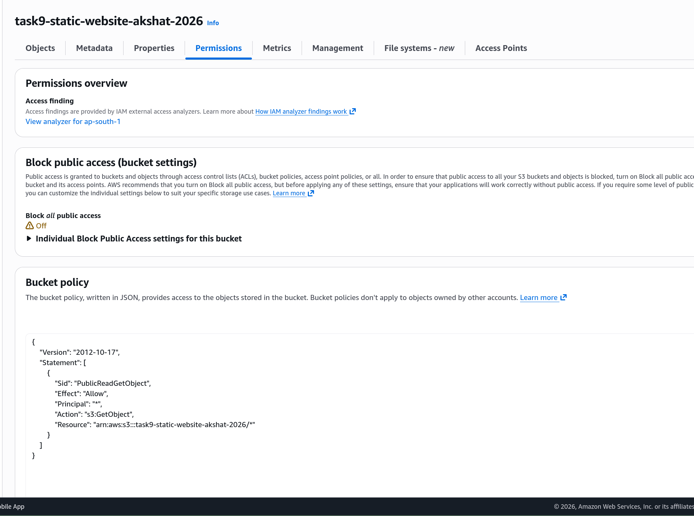
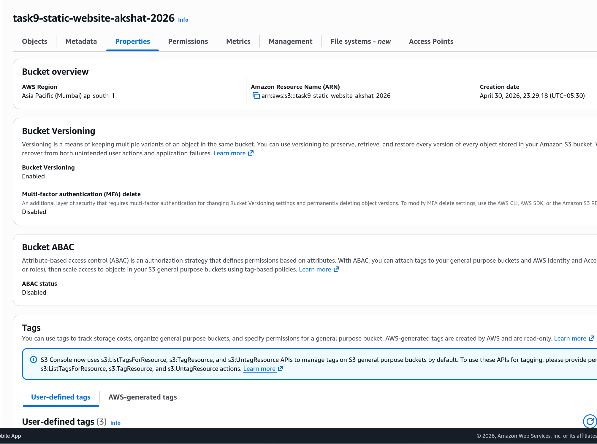
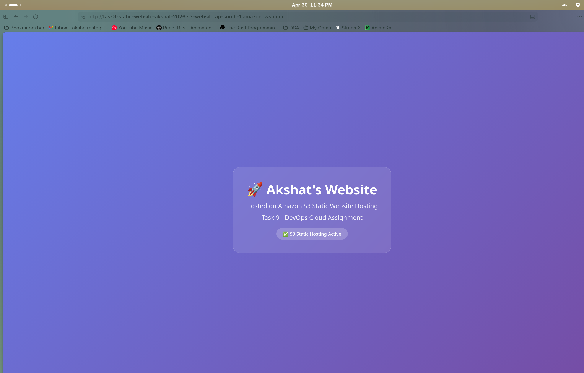

# Task 9: S3 Static Website Hosting

# Step 1

Created an S3 bucket and enabled static website hosting.

# Step 2

Configured the bucket properties for static website hosting with index.html as the index document.

# Step 3

Uploaded the HTML page content to the bucket.

# Step 4

Configured bucket policy for public read access so the website is accessible.

# Step 5

Enabled versioning on the bucket.

# Step 6

Accessed the static website via the S3 website endpoint URL in the browser.

